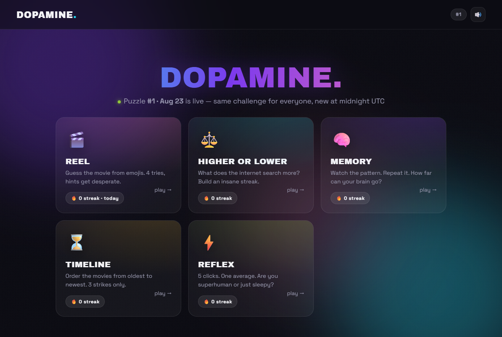
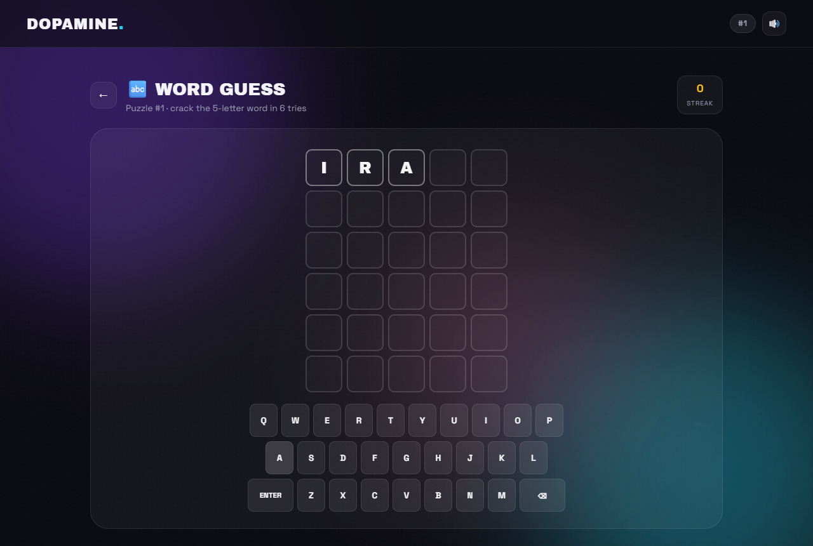
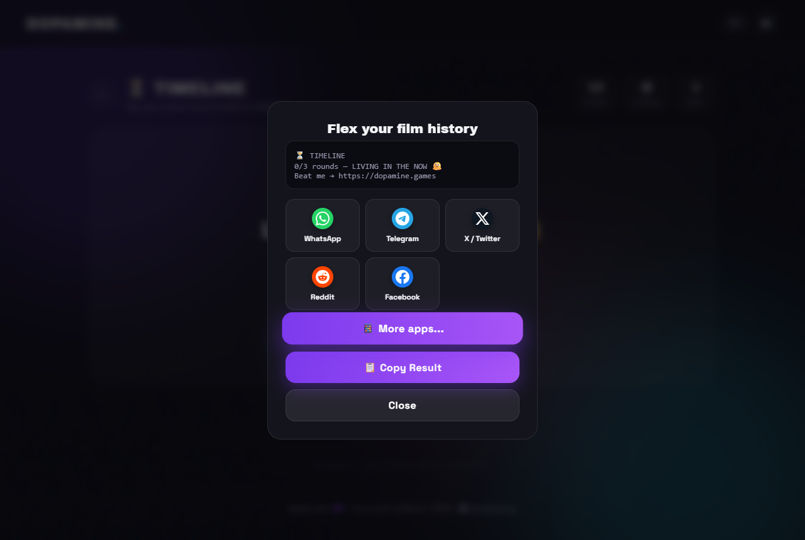

# 🎮 DOPAMINE. — Daily Arcade

> **Your daily dose of pointless brilliance.** 7 addictive mini-games, one global leaderboard, zero productivity.

<p align="center">
  
</p>

Same puzzles for everyone, every day — new at midnight UTC. Build streaks, climb the global leaderboard, share your results to WhatsApp with one tap. 🚀

---

## ✨ The Games

| | Game | What you do |
|---|---|---|
| 🎬 | **REEL** | Guess the movie from emojis — 5 daily rounds, hints get desperate, Wordle-style share grid |
| ⚖️ | **HIGHER OR LOWER** | What does the internet search more? Build an insane streak |
| 🔤 | **WORD GUESS** | Crack the hidden 5-letter word in 6 tries — flip animations + color-coded keyboard |
| 🧠 | **MEMORY** | Simon-style pattern game — watch, repeat, watch it get harder |
| ⏳ | **TIMELINE** | Order 4 movies from oldest to newest — 3 strikes only |
| 🏳️ | **FLAG RUSH** | 10 flags, 5 seconds each — how many countries do you know? |
| 🏎️ | **SPEED RUSH** | Dodge highway traffic at insane speeds — every meter counts |
| 🐍 | **SNAKE** | The classic. Eat apples, grow long, don't bite yourself |
| ⚡ | **REFLEX** | 5 clicks, one average. Superhuman or just sleepy? |

## 🏆 Features

- 🌍 **Global daily leaderboard** — every score competes, resets at midnight UTC
- 🔥 **Streak system** — play daily, keep the fire alive (per-game + best tracking)
- 📤 **One-tap sharing** — WhatsApp, Telegram, X, Reddit, Facebook + native share sheet with emoji result grids
- 🎨 **Juicy game feel** — confetti physics, screen pulses, count-up stats, per-game hover animations, synth sound effects (WebAudio, zero audio files)
- 📴 **Installable PWA** — works offline thanks to a service worker
- ⚙️ **Owner admin panel** — password-protected: configure ad slots, AdSense IDs, interstitial frequency; view/clear today's scores
- 🧩 **Zero frameworks** — vanilla JS ES modules, instant loads, tiny footprint

<p align="center">
  
  
</p>

## 🚀 Quick Start

```bash
npm install     # installs test deps only — the app itself has zero dependencies
npm start       # → http://localhost:4173
```

## 🧪 Testing

```bash
npm test        # 51 unit + API tests (game logic, RNG, storage, REST API, dedup)
npm run test:e2e  # 16 end-to-end tests in real Chrome (full gameplay flows)
```

E2E suite auto-detects Chrome/Edge — no browser downloads needed.

## ☁️ Deploying to Cloudflare ($0, no cold starts)

See **[DEPLOY-CLOUDFLARE.md](DEPLOY-CLOUDFLARE.md)** — the production target. Worker + D1 port of the API included in `cloudflare/`. Free tier handles ~3k daily players.

## 🔐 Owner Admin

Visit `/#/admin` on your deployed site:

- 🔑 Login with the `ADMIN_PASSWORD` environment variable
- ⚙️ Toggle ad slots, set AdSense client/slot IDs, interstitial frequency — **saved server-side, live for every visitor**
- 📊 View and clear today's scores
- 📤 Export a ready-to-paste AdSense snippet

> Without login, settings only preview locally — visitors can never change your config.

## ☁️ Deploy

Any Node host works (Render, Railway, Fly.io, a $4 VPS...):

1. Push this repo → create a Web Service → `node server.js`
2. Set `ADMIN_PASSWORD` env var
3. Point your domain at it and update `dopamine.games` links in `js/share.js` + meta tags

## 🏗️ Tech

- **Frontend:** Vanilla JS (ES modules), Canvas confetti, WebAudio synth, CSS animations — no build step
- **Backend:** Node `http` — static files + JSON API (`/api/score`, `/api/leaderboard`, `/api/admin/*`) with HMAC-signed admin auth
- **Storage:** JSON files (`data/`) — swap for a DB when you hit fame
- **Testing:** `node --test` (unit + API) + Playwright-core driving real Chrome

```
dopamine/
├── server.js            # static + API server
├── public/              # the entire app (no build step)
│   ├── index.html
│   ├── css/style.css
│   ├── js/              # rng, storage, audio, confetti, share, ads, juice…
│   │   └── games/       # one module per game + admin + leaderboard
│   ├── icons/ · og.png · sw.js · manifest
└── tests/               # unit + API + E2E
```

---

Made with 💜, ☕ and an unhealthy amount of 🎯

**Play → [dopamine.games](https://dopamine.games)**
